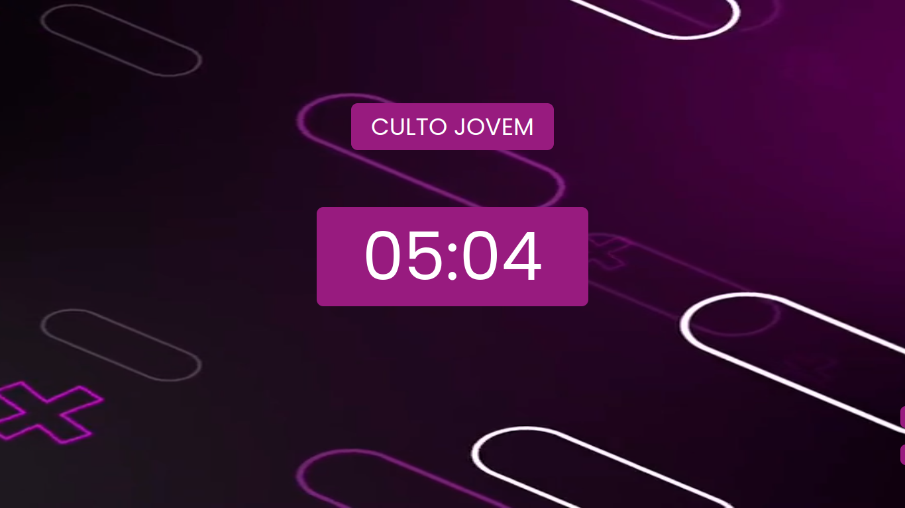
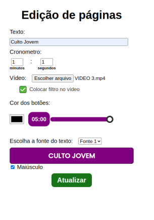

# WatchCronos

# Índice
- [Proposta](#id01)
- [Desafios](#id02)
- [Screenshots](#id03)
- [Links](#id04)
- [Feito_com](#id05)
- [Autor](#id06)

# 🚀 Proposta 

Este é um projeto de Cronômetro que possui um background de fundo totalmente personalizável. Ideal para criar expectativa antes de algumas apresentações

A ideia é disponibilizar um cronometro que não exija instalação, nem uso de autenticação. Uso livre!!

 

Data do início: 18/12/2022

# Desafios 

O maior aprendizado foi trabalhar com os Hooks do React.JS em especial o useContext, que prove o contexto de valores entre as páginas. Além disso foi super válido trabalhar com a arquitetura de pastas, o que permitiu o código ser bastante limpo e fácil manutenção.

Um grande desafio foi converter os valores de rgb para hexadecimal e usar um slider para trabalhar com a transparência. Outra dificuldade foi em trabalhar com o tempo dentro do hook useEffect e fazer com que não tenha memory Leak.

a parte mais fácil foi estruturar o estilo css e compartilha-lo com styled-components.

# :camera_flash: Screenshots 

  </img>

Preview do projeto

  </img>

Página de edição

# :heavy_check_mark: Links 

- Link para acessar: LINK

# 🛠 Feito com 

 

- 
- 
- 
- 

### Lista de tarefas:
- [x] Estruturar rotas e montar arquitetura Front-End.
- [x] Estruturar .jsx da Home.
- [x] Estilizar CSS da Home.
- [x] Criar função de cronometro na Home.
- [x] Estruturar .jsx da Edit Page.
- [x] Montar o Formulário da Edit Page.
- [x] Estruturar saída de informações do Formulário.
- [x] Criar contexto de informações do formulário.
- [x] Opção de texto em caixa alta.
- [x] Configurar vídeo de fundo.
- [x] Função de filtro de vídeo.
- [x] Animação de cor nos 10 segundos finais.
- [x] Criar a função de play e pause do cronômetro.

# :sunglasses: Autor 

- GitHub: https://www.github.com/RamosTailon

- Email: [tailonramos11@gmail.com](mailto:tailonramos11@gmail.com)

- Linkedin: https://www.linkedin.com/in/tailon-ramos-25271022a/